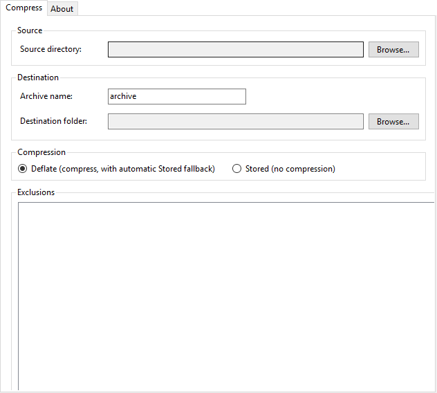

# ZipAll

A small, native Windows desktop app (C#/.NET, WinForms) that zips a folder — with exclusions, a custom archive name, and a choice of destination.



## Features

- **Pick a source folder, name the archive, pick a destination** — three native folder/file dialogs, no typing full paths by hand. A folder can also be dragged straight from Explorer onto the Source field.
- **Exclusions** — add individual files or whole folders to an exclusion list before compressing; wildcard patterns (`*`, `?`) are supported for both file names and folder paths, matched against the relative path or the leaf name.
- **Stored or Deflate compression**, selectable per archive, backed entirely by the .NET base class library (`System.IO.Compression`) — no re-implemented archive format. Deflate automatically falls back to Stored per file when compression wouldn't actually shrink it.
- **Optional password protection** — AES-256 encrypted archives via [SharpZipLib](https://github.com/icsharpcode/SharpZipLib), for when Stored/Deflate alone isn't enough.
- **Live progress and cancellation** — a progress bar and status label update per file during compression, with a Cancel button wired to a `CancellationToken`.
- **Post-compression summary** — file count, original/archive size, compression ratio, elapsed time, and (if any) a list of files that had to be skipped.
- **Robust on real-world folders**: paths longer than 260 characters, read-only/hidden/system files, and locked or access-denied files/folders are all handled gracefully — locked files are skipped and reported instead of aborting the whole archive.
- **Full Unicode path support**, native to .NET strings.
- **Command-line mode alongside the GUI** — script archive creation without launching the window; see [Command-line mode](#command-line-mode) below.
- **Windows Explorer "Send to" integration** — right-click a folder → *Send To* → *ZipAll* opens the app with that folder pre-filled as the source (optional, enabled during install).
- **About tab** with the application icon, name, version (read from assembly metadata), copyright, and clickable email/website links.
- **Self-contained** — the published `.exe` bundles the .NET runtime; nothing extra to install on the target machine.
- **White theme only**, native Win32-style look via WinForms — no third-party UI libraries.

## Installation

Download the latest installer from the [Releases](https://github.com/Patrickjaillet/ZipAll/releases) page (or build it yourself — see below) and run `ZipAllSetup-<version>.exe`. It installs ZipAll into `Program Files`, adds a Start Menu shortcut, an optional desktop shortcut, and an optional Explorer "Send to" shortcut, and registers a standard Windows uninstaller. No separate .NET runtime install is required.

Requires Windows 10 or later, x64.

## Usage

1. **Source Directory** — click *Browse*, or drag a folder from Explorer onto the field, to pick the folder you want to archive.
2. **Archive Name** — type a name for the resulting `.zip` (the `.zip` extension is added automatically if you leave it off).
3. **Destination Folder** — click *Browse* and pick where the archive should be saved.
4. **Compression** — choose *Stored* (fastest, no compression) or *Deflate* (smaller archives; the default). Optionally check **Password-protect** and enter a password to produce an AES-256 encrypted archive.
5. **Exclusions** (optional) — click *Add File(s)* or *Add Folder* to exclude specific files or subfolders from the archive; select an entry and click *Remove* to drop it.
6. Click **Start**. Progress and the current file being compressed are shown live; click **Cancel** at any time to abort.
7. When finished, a summary dialog reports the file count, archive size, compression ratio, elapsed time, and any files that were skipped (locked/inaccessible).

The **About** tab shows the installed version, copyright, and links to contact the author or visit the project website.

## Command-line mode

Launching `ZipAll.exe` with no arguments (or with a single existing folder as the only argument, e.g. from *Send to*) opens the GUI. Passing any flag starting with `-` switches to a headless command-line mode instead:

```
ZipAll.exe --source <dir> --dest <dir> [--name <name>] [--mode deflate|stored]
           [--password <password>] [--exclude-file <pattern>]... [--exclude-dir <pattern>]...
           [--quiet]

ZipAll.exe --help
```

- `--source` and `--dest` are required; everything else is optional.
- `--exclude-file` / `--exclude-dir` are repeatable and accept the same wildcard patterns as the GUI's exclusion list.
- `--password` produces an AES-256 encrypted archive, verified before the process exits.
- Exit code `0` on success, non-zero on failure or a missing/invalid argument.

## Building from source

Requires the [.NET 8 SDK](https://dotnet.microsoft.com/download) (Windows, for `net8.0-windows`/WinForms).

```powershell
# Debug build
.\build.ps1

# Self-contained, single-file Release publish (win-x64) -> .\publish\
.\build.ps1 -Publish

# Publish + build the Inno Setup installer -> .\dist\ZipAllSetup-<version>.exe
# (requires Inno Setup 6 (https://jrsoftware.org/isinfo.php), ISCC.exe on PATH)
.\build.ps1 -Installer
```

```bash
# Equivalent commands on Linux/macOS shells (still targets win-x64; the
# installer step additionally needs ISCC under Wine, since Inno Setup itself
# only runs on Windows)
./build.sh
./build.sh --publish
./build.sh --installer
```

Both scripts accept `--build-number` / `-BuildNumber` to override the auto-generated build number (e.g. from CI). See [`Directory.Build.props`](Directory.Build.props) for the `MAJOR.MINOR.BUILD` versioning scheme.

### Project layout

```
src/ZipAll.Core/   Core library: directory walker, exclusion engine, plain and AES-encrypted ZIP writer/verifier (no UI dependency)
src/ZipAll/        WinForms application (main window, About tab) plus the command-line mode (Program.cs, CliOptions, CliRunner)
res/icons/         Application and installer icons (multi-resolution .ico, plus 256x256 source PNGs)
installer/         Inno Setup script (ZipAll.iss) that packages the self-contained publish output
tests/             ZipAll.Core.Tests (xUnit) plus manual round-trip harnesses (ManualHarness, ExclusionHarness)
docs/              Documentation assets (screenshot.png)
```

### Running the tests

```powershell
dotnet test tests/ZipAll.Core.Tests/ZipAll.Core.Tests.csproj
```

See [`tests/REGRESSION_CHECKLIST.md`](tests/REGRESSION_CHECKLIST.md) for the manual pass to run against a built installer before every release.

## License

MIT — see [LICENSE](LICENSE).

## Contributing

See [CONTRIBUTING.md](CONTRIBUTING.md).

## Author

Patrick JAILLET
Email: contact.shaderstudio@gmail.com
Website: https://patrickjaillet.github.io/sandefjord-software
